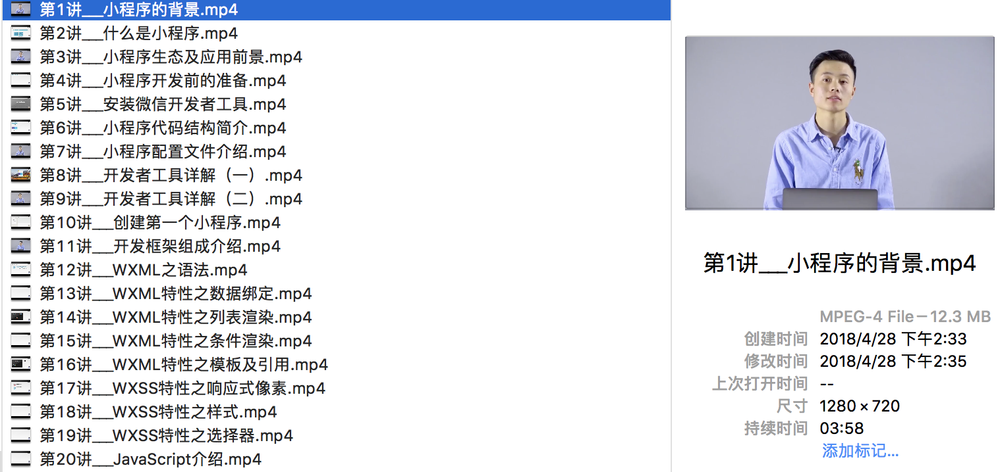

# GeekTime 下载极客时间音视频
---

### [下载《极客时间》音视频（一）](http://iosdevlog.com/2018/04/19/time.html)
### [下载《极客时间》音视频（二）](http://iosdevlog.com/python/2018/04/26/geektime.html)
### [下载《极客时间》音视频（三）](http://iosdevlog.com/2018/04/28/geek-time.html)

---

# screenshot



# useage

1. login <http://geekbang.org> from chrome first

2. work on python3 virtualenv

```bash
(geektime) pip install -r requirements.txt
(geektime) python download_audio.py
(geektime) python download_audio_by_cid.py
login 'http://geekbang.org' from chrome first
...
id = 78  type = other  column_title = 架构师
id = 50  type = audio  column_title = 邱岳的产品手记
id = 77  type = video  column_title = 9 小时搞定微信小程序开发
input audio column id
> 50
...
100%[===========================================================>]   1.87K  --.-KB/s    in 0s
...
...
...
(geektime) python download_video_by_cid.py
login 'http://geekbang.org' from chrome first
...
id = 78  type = other  column_title = 架构师
id = 50  type = audio  column_title = 邱岳的产品手记
id = 77  type = video  column_title = 9 小时搞定微信小程序开发
input audio column id
> 77 
...
第91讲___小程序之性能优化
{"hd":{"size":172783023,"url
libavutil      55. 78.100 / 55. 78.100
libavcodec     57.107.100 / 57.107.100
libavformat    57. 83.100 / 57. 83.100
libavdevice    57. 10.100 / 57. 10.100
libavfilter     6.107.100 /  6.107.100
libavresample   3.  7.  0 /  3.  7.  0
libswscale      4.  8.100 /  4.  8.100
libswresample   2.  9.100 /  2.  9.100
libpostproc    54.  7.100 / 54.  7.100
...
```


# License
---

GeekTime is released under the MIT license. See LICENSE for details.
